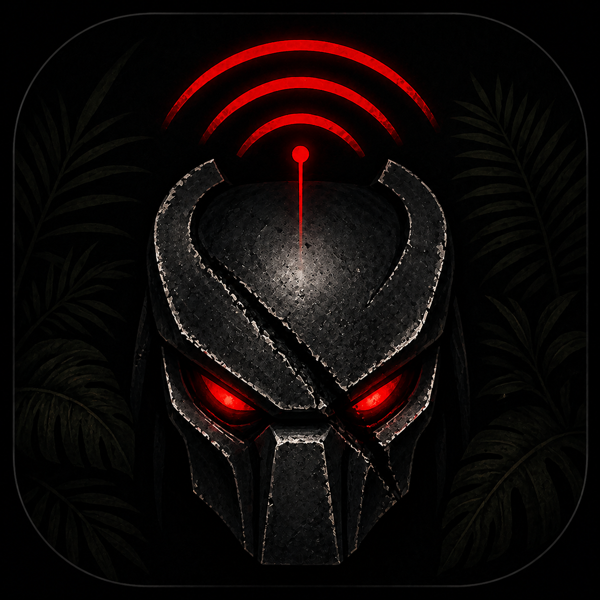

<p align="center">
  
</p>

# Predator RF

**A solo-SIGINT-operator cockpit. Software-defined radio, fleet coordination, geolocation, and ATAK push — built for the operator who has to do all four jobs alone.**

Built on top of the open-source [SDR++](https://github.com/AlexandreRouma/SDRPlusPlus) core, Predator RF replaces the traditional radio-hobby interface with a clean, mission-oriented UI for real-world spectrum work — automated frequency monitoring, signal classification, multi-sensor fusion, time-difference-of-arrival (TDOA) geolocation, and ATAK / TAK CoT integration. **RX-only by policy** — every output (CoT, AutoTasker re-tunes) sits behind explicit two-key gates so an automated assessment can never bypass operator intent.

> **Status:** Active development. Android phone-only deployment is the primary target; Python backend + Raspberry Pi sensor nodes are the second.

> **Full operator-side documentation:** [`docs/OPERATOR_GUIDE.md`](docs/OPERATOR_GUIDE.md) (29-page PDF: [`docs/Predator_RF_Operator_Guide.pdf`](docs/Predator_RF_Operator_Guide.pdf)) — the standalone "if you have to pick this up cold and conquer" guide. This README is the project overview; the operator guide is the field manual.

---

## Two deployment paths

The system is designed around two equally-supported deployment modes. Pick one or both — they're built to mix.

### Path 1 — Phone-only (Android)
The C++ Predator RF app on a Galaxy S22 (or any Android 10+ device), driving a USB SDR through an OTG cable. Standalone — no other infrastructure needed. The phone IS the cockpit. Optionally peers with other phones / RPi sensors via the Kujhad fleet protocol over WiFi or a private overlay (ZeroTier / Tailscale).

### Path 2 — Linux TOC + RPi sensor nodes (Python backend)
A Python backend service runs on a Linux operator workstation or a Raspberry Pi. It owns persistence (SQLite mission ledger), aggregates events from one or more Kujhad-equipped C++ sensor nodes via HTTP, runs the TDOA coordinator, decision engine, AutoTasker, and CoT emitter centrally, and exposes a REST + SSE API for any UI / dashboard. A typical mission has one Linux workstation running the backend + ATAK plumbing, two-to-four phones in the field with the Android app each sharing into Kujhad, and one or two RPi sensors dropped at fixed points. All of it fuses into one operator screen.

---

## Table of Contents

- [What's New](#whats-new)
- [Features](#features)
- [Geolocation: TDOA + single-node RSSI proximity](#geolocation-tdoa--single-node-rssi-proximity)
- [The two-key safety model](#the-two-key-safety-model)
- [Supported Hardware](#supported-hardware)
- [Installation — Android](#installation--android)
- [Installation — Python backend (Path 2)](#installation--python-backend-path-2)
- [Building from Source](#building-from-source)
- [User Guide — the eight tabs](#user-guide--the-eight-tabs)
- [ATAK / TAK CoT Integration](#atak--tak-cot-integration)
- [RNS / Reticulum transport (and ATAK forwarder)](#rns--reticulum-transport-and-atak-forwarder)
- [Kujhad Fleet Console](#kujhad-fleet-console)
- [Decoder Modules](#decoder-modules)
- [Tiered Bill of Materials](#tiered-bill-of-materials)
- [Roadmap](#roadmap)
- [Third-Party Licenses](#third-party-licenses)
- [Contributing](#contributing)

---

## What's New

### v1.3.1 — RNS (Reticulum) transport / ATAK forwarder
- **RNS daemon shipped in the Python backend** (`backend/rns/`, pinned to upstream Reticulum 1.2.0). Nine interface types — TCP client / TCP server / UDP / I2P / AutoInterface / RNode (LoRa) / KISS TNC / AX.25 KISS / Pipe — managed from a new "RNS Interfaces (Reticulum)" panel inside Kujhad.
- **Doubles as an ATAK forwarder, RTAK-style.** Outbound CoT escalations are pushed both over the existing TAK UDP/TCP path **and** into RNS in parallel; inbound CoT received over RNS is auto-forwarded to a local TAK app over UDP. **Android default = 4242** (peer-relayed tracks appear on your TAK map with zero operator action); Linux opt-in via `RNS_ATAK_LOCAL_PORT`.
- **Replication tokens** — Argon2id-derived XChaCha20-Poly1305 IETF bundles let you clone an RNS posture between nodes without retyping every field. Device-local fields (serial ports, LAN IPs) are swapped for placeholders during mint and re-prompted on import. Identity-included and identity-excluded variants both supported.
- **Local-only control plane on every platform.** Linux uses a uid-checked Unix socket (`ControlServer`); Android uses `LocalSocket` (kernel-enforced same-app boundary). The HTTP RNS routes exist as importable scaffolding but are deliberately not mounted — there is no remote attack surface for the daemon.
- **Linux / Android UI parity.** Same C++ Kujhad panel renders on both via `NativeActivity`; full coverage of every COMMON field (including the new IFAC pre-shared-key block — `ifac_netname` / `ifac_netkey` / `ifac_size`), every per-type field for all 9 interface types, restart-with-drain, status (online/rxb/txb/bitrate/clients), live log tail, mint / import / export, peer allowlist.
- **IFAC (Interface Access Code) wired end-to-end.** Reticulum's per-interface pre-shared-key gate — when set, every link-layer frame is hashed with the netkey so non-keyed nodes can't decode framing at all (defence in depth above the peer allowlist). Surfaced in the Kujhad live-status table as a green `[IFAC]` badge with a netname tooltip on hover; the netkey itself is write-only — never echoed back in status, never stored in cleartext, only ever leaves the device inside an AEAD-encrypted replication token. Bundled inside replication tokens by default; clear the fields before mint if you want the receiving operator to set their own.
- 59 RNS unit tests passing.

### v1.3.0 — Cockpit / Fleet / Geolocation
- **Python backend (Path 2)** — runs on a Linux workstation or RPi; owns the SQLite mission ledger, aggregates events from C++ Kujhad devices, exposes a token-protected REST + SSE API on `:8000`. CoC mode chains backends together as a TOC-of-TOCs.
- **TDOA multilateration** — when ≥2 GPS-synchronized nodes hear the same emission within a 5 s window, the fusion module computes a hyperbolic least-squares position fix with a confidence-scaled error ellipse (50 m → 5 km). Inclusive policy: cheap RTL-SDR nodes participate even without a GPSDO; their timing trust is just capped lower so the fix's confidence reflects the kit.
- **Single-node RSSI proximity fallback** *(opt-in via `RSSI_PROXIMITY_ENABLED=true`)* — when only one sensor is in play, the system can render a wide circle around the detecting node using free-space path-loss + an assumed transmitter EIRP. **Not a real geolocation** — confidence is hard-capped at 0.20 and the radius is intentionally wide. Useful for walking-the-perimeter recon (the circle visibly contracts as the operator gets closer to a strong source).
- **Track lifecycle state machine** — every emitter goes through NEW → TRACKING (≥3 obs) → STABLE (≥10 obs) → COASTING → LOST. AutoTasker and CoT escalation are gated by state.
- **AutoTasker** *(opt-in)* — when an assessment recommends `focus_all_nodes`, automatically re-tunes every TDOA-capable node to the track's frequency. Three brakes: per-node 30 s rate limit, already-tuned ±2 kHz check, and a global per-fleet budget of 30 tunes/min.
- **Mission ledger + AAR export** — `POST /api/v1/missions` opens a mission; everything (events, tracks, assessments, approvals, override changes) is grouped by `mission_id`; `GET /api/v1/missions/<id>/export` returns a JSONL tarball as the after-action package.
- **Operator overrides** — friendly list, frequency blacklist, and manual location override (operator-supplied lat/lon, pinned at 0.95 confidence, wins over TDOA).
- **CoT two-key gate** — operator-level kill switch + per-track escalation flag, plus an optional third gate (`COT_REQUIRE_MANUAL_APPROVAL=true`) that queues every escalation for explicit operator approve / reject before the packet leaves.
- **Inclusive hardware capability table** — RTL-SDR Blog v4, HackRF One, Airspy R2, LimeSDR, bladeRF 2.0, ADALM-PLUTO, and SoapySDR are all first-class; the trust calculus knows each radio's noise figure, frequency stability, and timing uncertainty so good kit gets weighted accordingly without locking out cheap kit.

### v1.2.0
- **ATAK CoT integration** — sends GeoChat hit alerts and SA beacons to any TAK endpoint when a targeted frequency is detected; device appears on the ATAK map as a friendly unit at the phone's GPS fix.
- **Right rail fully visible on all phone sizes** — deterministic layout, NoScrollbar, adaptive slider heights.
- **Spectrum no longer freezes during scanning** — debounced event disk writes prevent I/O from blocking the render thread.
- **Confirmation dialogs** before clearing hits or events.
- **Keyboard-safe text editing popup** — naming a hit opens a modal anchored above the Android keyboard.

### v1.1.0
- Live spectrum scanning without freezing on signal detection.
- Hit and target frequency marker overlays on FFT and waterfall.
- VFO markers that track signal frequencies during scanner retunes.
- Touch-scroll fix in overlay panels.
- Enhanced Mission tab with frequency display and improved delete buttons.
- Resolved keyboard overlap issue on Android.

---

## Features

### Signal Detection & Recording
- **Continuous FFT peak detection** above a configurable SNR threshold every render frame.
- **Hit recording** — each confirmed detection is saved with frequency, dBFS, SNR, decoder output, label, notes, and GPS-stamped timestamp.
- **Duplicate suppression** — configurable window (default 20 s) prevents the same frequency spamming the hit list.
- **Strong-hit extended dwell** — stays on a strong signal instead of stepping away mid-transmission.
- **State classification** — tag each hit as Target, Exclude, Unknown, or Archived.
- **Baseline learning** — record what the noise floor / normal traffic looks like in an area, save it, then suppress it next time so only NEW signals fire as hits.

### Operating Modes
- **Manual** — direct operator tuning; all detector resources are under operator control.
- **Classify** — manual control while background watchers check idle spectrum segments.
- **Scan** — automated stepping across configured search bands with per-band dwell times.
- **QuickScan** — rapid single-pass sweep across all enabled bands for situational awareness.

### Spectrum Display
- Full waterfall + FFT display inherited from SDR++.
- Hit, target, exclude, and peer markers overlaid on the live spectrum (yellow / green / red / cyan dashed).
- Search band shading directly on the waterfall.
- Right-rail sliders for Zoom, FFT Max, FFT Min — always accessible.
- Peer spectrum mirroring via Kujhad.

### Multi-sensor Fusion
- **Hardware-aware track associator** — 100 kHz frequency-bucket index for O(1) candidate lookup; tolerance scales with each radio's PPM accuracy.
- **Bayesian confidence engine** — six factors (observation saturation, node trust, multi-node agreement, temporal consistency, frequency stability, hardware quality) into a single track confidence in [0.01, 0.99].
- **Per-node trust score** — composite of base trust × uptime × (1 − false-positive rate) × hardware factor (frequency stability + sensitivity + timing) with a 0.7× thermal-throttle multiplier. Drives observation weighting in fusion.
- **Anomaly detection** — pumps anomaly flags into the threat assessment; high-severity flags can trigger automatic AutoTasker focus or CoT escalation (subject to operator gates).

### Target & Mission Management
- Named **target frequency slots** prioritised by the scanner; hits there are flagged "target".
- **Search bands** — define start/stop ranges for automated scanning.
- **Exclude bands** — frequencies the scanner skips entirely.
- **Friendly list / blacklist / manual location** — operator overrides that survive restarts and ride through the audit log.
- **Mission lifecycle** — start mission, run, end mission, export the AAR tarball as the after-action package.

### ATAK / TAK Integration
- **CoT GeoChat** messages on every escalated hit.
- **SA beacons** (`a-f-G-U-C`) at a configurable interval — device shows as a friendly unit on the ATAK map.
- **Two-key gate** — operator-level kill switch + per-track escalation flag both required.
- **Optional manual-approval queue** — third key for the field; every escalation enqueues for explicit operator approve/reject before the packet leaves.
- Supports UDP multicast (ATAK LAN), UDP unicast, direct TCP to a TAK Server, and TLS.
- Per-emitter rate limit (default 5 s) so a chatty source can't flood TOC.

### Kujhad Fleet
- Hub-and-spoke peer protocol — each instance can be a Device (publishes state + event stream), a Controller (consumes from peers), or both.
- Tiny HTTP/1.1 + JSON over a private overlay (ZeroTier / Tailscale recommended) or LAN.
- Per-peer API key authentication (`X-Kujhad-Key` header).
- **Optional TLS with SHA-256 certificate pinning** — fingerprint exchanged out-of-band; mismatches abort the connection. When TLS is on, plain HTTP is locked to loopback only.
- Endpoints: `GET /v1/identify` `gps` `state` `events` `timing` and `POST /v1/command` (rejects any `tx`-class command at the dispatcher — the module never opens a transmit path).

### Decoder Integration
- **RTL-433** — hundreds of ISM-band sensors (weather, temperature, humidity, power meters, garage openers).
- **DSD-FME** — P25 Phase 1 & 2, DMR, D-STAR, NXDN digital voice.
- **ADS-B** — aircraft transponders at 1090 MHz.
- **M17** — M17 amateur digital voice.
- **AIS** — marine vessel tracking (NEW).
- **POCSAG** — pager protocol (NEW).

### Android-Specific
- GPS-driven SA beacons and hit location tagging.
- Touch-first ergonomics: large tap targets, finger-sized scrollbars, immersive fullscreen.
- USB OTG SDR attachment via Android USB host API.
- Persistent app directory — config, hits, events, baselines, and mission lists survive restarts and updates.

---

## Geolocation: TDOA + single-node RSSI proximity

Two independent geolocation paths, picked automatically based on what's available:

### TDOA (≥2 GPS-synced nodes)

When two or more sensor nodes with GPS lock hear the same emission within a 5-second window, the TDOA coordinator computes a hyperbolic least-squares position fix.

| Configuration | What you get |
|---|---|
| 1 distinct node | Falls back to RSSI proximity (if enabled) or no fix |
| 2 distinct nodes | Midpoint fallback, `confidence = 0.3 × mean(timing_trust)` |
| 3+ distinct nodes | 50-iter LSQ in a local ENU frame, geometric `confidence = min(0.95, 0.5 + 0.1·N) × mean(timing_trust)` |

**Timing trust** per node ranges 0.30 (system-clock only) to 0.98 (GPSDO + PPS lock + |offset| < 10 ms), with a −0.20 penalty for last-sync > 5 min. Cheap nodes participate too — their fix just carries lower confidence.

**The error ellipse:**
- Base radius scales as `50 m + (1 − confidence) × 4950 m` — high-confidence fixes shrink toward 50 m, zero-confidence fixes grow toward 5 km.
- Eccentricity comes from the geometry of the participating nodes (clustered → near-circular; strung along a line → long thin ellipse perpendicular to the baseline, matching TDOA's actual physics).
- This is the difference between a 50 m fix and a 5 km search area — both look like the same dot without it.

### RSSI proximity (single-node fallback, opt-in)

When you have only one sensor and you set `RSSI_PROXIMITY_ENABLED=true`, the system uses free-space path-loss + an assumed transmitter EIRP to render a wide circle around the detecting node.

- **Hard-capped at 0.20 confidence** — TX power is unknown, so the system can never be highly confident about distance.
- **No bearing information** — the emitter is "somewhere within radius `r` of the sensor, in some unknown direction."
- **TDOA always wins** — as soon as a second GPS-synced node hears the same emitter, the proximity circle is replaced by the proper TDOA ellipse.
- **Off by default** because the result is easy to over-trust if the UI doesn't render it as a wide circle.

Useful for: walking-the-perimeter recon (circle visibly contracts as the operator approaches a strong source), coarse "within 100 m or within 5 km" bucketing, giving TAK a non-trivial CE radius. Not useful for: reporting actual emitter coordinates upstream, wildly-mismatched assumed-EIRP bands, heavy clutter / urban canyon.

Tuning knobs (env vars): `RSSI_ASSUMED_EIRP_DBM` (default 30 = 1 W handheld), `RSSI_DBFS_TO_DBM_OFFSET` (default −30), `RSSI_RADIUS_UNCERTAINTY_FACTOR` (default 2.0; bump to 3-4 in clutter), `RSSI_MIN_RADIUS_M` / `RSSI_MAX_RADIUS_M` (50 / 5000).

---

## The two-key safety model

Predator RF starts in **RX-only** posture. Every output sits behind explicit gates so a software bug or false-positive cannot unilaterally produce an action:

| Output | Gate 1 | Gate 2 | Gate 3 (optional) |
|---|---|---|---|
| **CoT to TAK** | `COT_ENABLED` operator switch | `assessment.escalate_to_atak` (auto-set for high/critical threats) | `COT_REQUIRE_MANUAL_APPROVAL` queues every escalation for operator approve/reject |
| **AutoTasker re-tune** | `AUTO_TASKER_ENABLED` operator switch | Per-node 30 s rate limit | Global per-fleet budget (30 tunes/min default) + already-tuned ±2 kHz check |
| **Kujhad transmit command** | (none — rejected) | The dispatcher unconditionally rejects any `tx`-class command | n/a — the module physically never opens a transmit path |

`critical` threats are **never** auto-actioned regardless of AutoTasker state — the operator pushes the button.

---

## Supported Hardware

| SDR | Freq range | Max sample | NF | MDS | TDOA | Timing | Price |
|---|---|---|---|---|---|---|---|
| **RTL-SDR Blog v4** | 25 MHz – 1.7 GHz | 3.2 MS/s | 6.0 dB | -110 dBm | no | 1000 ns | $40 |
| **HackRF One** | 1 MHz – 6 GHz | 20 MS/s | 10.0 dB | -100 dBm | yes | 500 ns | $300 |
| **Airspy R2** | 24 MHz – 1.7 GHz | 20 MS/s | 2.5 dB | -125 dBm | yes | 50 ns | $170 |
| **Airspy HF+ Discovery** | 0.5 kHz – 31 MHz, 60 – 260 MHz | 0.768 MS/s | 1.0 dB | -140 dBm | yes | 50 ns | $170 |
| **LimeSDR-USB** | 100 kHz – 3.8 GHz | 61.4 MS/s | 3.0 dB | -120 dBm | yes (PPS out) | 100 ns | $600 |
| **bladeRF 2.0** | 47 MHz – 6 GHz | 61.4 MS/s | 4.0 dB | -118 dBm | yes | 80 ns | $480 |
| **ADALM-PLUTO** | 325 MHz – 3.8 GHz | 61.4 MS/s | 5.0 dB | -115 dBm | yes | 200 ns | $200 |
| **SDRplay RSPdx, RSP1A** | 1 kHz – 2 GHz | 10 MS/s | 4.5 dB | -118 dBm | no | 500 ns | $150–$220 |
| **KiwiSDR** (network) | 0.01 – 30 MHz | — | — | — | no | — | $300 |
| **SpyServer** (network) | varies | — | — | — | no | — | $0 |

Practical guidance: pick **Airspy R2** or **LimeSDR** for serious TDOA work (low timing uncertainty + high sensitivity). **HackRF** is the workhorse for HF coverage. **RTL-SDR Blog v4** is the cheap "I'm here too" node — TDOA participation is fine, the timing trust just gets capped.

---

## Installation — Android

### Requirements
- Android 9 (API 28) or newer.
- USB OTG cable for directly attached SDRs, **or** a network SDR source (SpyServer, KiwiSDR, RTL-TCP).
- "Install from unknown sources" enabled in Android settings.

### Sideload Steps
1. Download `app-debug.apk` from the [Releases page](https://github.com/JakeTheSnake0245/Predator-SDR/releases).
2. Transfer the APK to your device (USB, ADB, cloud, etc.).
3. Tap the APK and confirm installation when prompted.
4. Launch **Predator RF** from the app drawer.
5. Grant Location, Storage, and USB device permissions when asked.
6. Connect your SDR via USB OTG or configure a network source in the **System** tab.

### ADB Sideload
```bash
adb install -r app-debug.apk
```

---

## Installation — Python backend (Path 2)

The backend is the brain of the multi-node deployment. It aggregates events from one or more Kujhad devices, runs the TDOA coordinator, persists everything to a SQLite mission ledger, and exposes a token-protected REST + SSE API.

### Quick start (Linux / Debian / Ubuntu / Raspberry Pi OS)

```bash
sudo mkdir -p /opt/predator-rf /etc/predator-rf /var/lib/predator-rf/backups
sudo git clone https://github.com/JakeTheSnake0245/Predator-SDR.git /opt/predator-rf
cd /opt/predator-rf
sudo python3 -m venv venv
sudo venv/bin/pip install -r requirements.txt
sudo cp deploy/predator-rf.env.example /etc/predator-rf/predator-rf.env
sudoedit /etc/predator-rf/predator-rf.env       # set FLEET_NODES, API_BEARER_TOKEN
sudo cp deploy/predator-rf.service /etc/systemd/system/
sudo systemctl daemon-reload
sudo systemctl enable --now predator-rf
```

The backend listens on `:8000`. Quick sanity checks:

```bash
curl localhost:8000/healthz                                                   # health
curl -H "Authorization: Bearer $TOKEN" localhost:8000/api/v1/nodes            # fleet
curl -H "Authorization: Bearer $TOKEN" localhost:8000/api/v1/tracks           # live tracks
curl -H "Authorization: Bearer $TOKEN" localhost:8000/api/v1/approvals        # CoT queue
curl localhost:8000/metrics                                                    # Prometheus
```

### Wiring a Kujhad device into `FLEET_NODES`

```
FLEET_NODES=alpha@192.168.1.10:41947:<api_key>:hackrf,bravo@192.168.1.11:41947:<api_key2>:rtlsdr
```

Format per node: `node_id@host:port:api_key:hardware_code`. The backend identifies each node, mirrors its state every 5 s, polls events and GPS at 1 Hz, and pulls timing telemetry every 30 s.

See [`docs/OPERATOR_GUIDE.md`](docs/OPERATOR_GUIDE.md) § 20 for the full env-var reference (every knob), RPi sensor-node setup, and CoC mode (TOC-of-TOCs).

---

## Building from Source

### Android Debug APK
```bash
git clone https://github.com/JakeTheSnake0245/Predator-SDR.git
cd Predator-SDR/android
./gradlew assembleDebug
# Output: android/app/build/outputs/apk/debug/app-debug.apk
```

Prereqs: Android NDK r23.2 (set path in `android/local.properties`), Android SDK 33+, CMake 3.21+, Gradle 8+.

On Windows from `C:\Users\cjake\TEMP\Predator-RF`:
```powershell
cd C:\Users\cjake\TEMP\Predator-RF
git pull origin master
cd android
.\gradlew assembleDebug
```

### Desktop (Linux / Windows / macOS)
```bash
mkdir build && cd build
cmake .. -DOPT_BUILD_PREDATOR_MODULES=ON
make -j$(nproc)
```

Refer to the upstream [SDR++ build guide](https://github.com/AlexandreRouma/SDRPlusPlus#building) for dependency details.

---

## User Guide — the eight tabs

The whole app is organized into eight tabs on the right rail.

| Code | Name | What it's for |
|---|---|---|
| **SPEC** | Spectrum | Live waterfall + tuner. Where you actually look at signals. |
| **HITS** | Hits & Events | Every signal the app has noticed, plus the running event log. |
| **NET** | Network | Catalog of known networks / talkgroups / aliases. |
| **MAP** | Map | GPS-stamped hits, TDOA fixes with error ellipses, RSSI proximity circles, node positions. |
| **MIS** | Mission | Mode (Manual / Classify / Scan / QuickScan), search bands, targets, excludes, dwell. |
| **KUJ** | Kujhad Fleet | Link this device to other phones / RPi sensors over a network. |
| **SYS** | System | App settings — modules, themes, decoders, ATAK/CoT, baseline comparison, TLS pinning. |
| **BASE** | Baseline | Record/load "normal" RF for the area; suppress baseline matches so only NEW signals fire as hits. |

Full per-tab walkthroughs and the day-one workflows are in [`docs/OPERATOR_GUIDE.md`](docs/OPERATOR_GUIDE.md) §§ 6 – 8.

### Right-rail layout

```
┌──────────────────────────────────────────────────────┬────────┐
│ Status bar  [LIVE]  [Source]  [Mode]  [GPS] [KUJ]    │  SPEC  │
├──────────────────────────────────────────────────────┤  HITS  │
│ Control bar — frequency selector, tuning mode         │  NET   │
├──────────────────────────────────────────────────────┤  MAP   │
│            Spectrum + Waterfall                       │  MIS   │
│       (hit/target/exclude/peer markers)               │  KUJ   │
│                                                       │  SYS   │
│  ┌────────────────────────────────────────────────┐  │  BASE  │
│  │  Overlay panel (opens on tab tap)              │  │        │
│  └────────────────────────────────────────────────┘  │  Zoom  │
│                                                       │  Max   │
│                                                       │  Min   │
└──────────────────────────────────────────────────────┴────────┘
```

The status bar shows live indicators for: SDR state (LIVE / READY / NOT READY), current source, mission mode, GPS lock + age, Kujhad fleet status, CoT enable state. Each is tappable to jump to the relevant config.

### Marker key
| Marker | Colour | Meaning |
|---|---|---|
| Vertical line | Yellow | Recorded hit |
| Tick at top | Green | Configured target frequency |
| Band shading | Blue-tinted | Active search band |
| Band shading | Red-tinted | Exclude band |
| Vertical line (dashed) | Cyan | Peer hit (Kujhad mirror mode) |
| Tight ellipse on map | colour by threat | TDOA fix — semi-major axis shows 1σ uncertainty |
| Wide circle on map | dim grey | RSSI proximity estimate (single-node fallback) |

---

## ATAK / TAK CoT Integration

Predator RF can send Cursor-on-Target XML to any TAK-compatible endpoint when an emitter is escalated, and periodically broadcast SA position updates so the device appears as a friendly unit on the ATAK map.

### Quick Setup

1. Open **System** tab → **TAK Integration**.
2. Toggle **Enable TAK CoT reporting**.
3. Set **Protocol** (UDP for LAN multicast, TCP for direct to TAK Server).
4. Set **Host** (`239.2.3.1` for ATAK LAN multicast, your TAK Server IP for unicast).
5. Set **Port** (`6969` for ATAK SA multicast, `4242` for direct UDP, `8087` TLS, `8088` plain TCP).
6. Set **Callsign** and **Chat Room**.
7. Enable **Sensor mode** to appear as a dedicated Predator RF sensor entity.
8. Set **SA interval** (5–300 s, default 30 s).
9. **Recommended in the field:** enable **Require manual approval** so every escalation is queued for explicit operator approve / reject before the packet leaves.
10. Tap **Send Test Message** to verify reception in ATAK.

### Message Formats

**SA Beacon** (`a-f-G-U-C`, friendly ground unit) — sent every SA interval; contains callsign, UID, GPS, and CE from the phone's location fix.

**Hit Alert** (`a-u-G` ground unknown when there's a TDOA fix; `b-m-p-s-p-loc` point of interest when only a fallback location) — sent when an escalated track passes the gates. The `point ce` field encodes the geolocation uncertainty (50 m for high-confidence TDOA → 5 km for low-confidence, matching the on-app ellipse). Per-emitter rate-limit: 5 s.

### Endpoint Reference

| Scenario | Host | Port | Protocol |
|---|---|---|---|
| ATAK on same LAN (no server) | `239.2.3.1` | `6969` | UDP multicast |
| ATAK on same device | `127.0.0.1` | `4242` | UDP |
| TAK Server (unencrypted) | Server IP | `8088` | TCP |
| TAK Server (TLS) | Server IP | `8087` | TCP |
| WinTAK on same network | WinTAK IP | `4242` | UDP |

Full CoT field-by-field breakdown and the manual-approval queue API are in [`docs/OPERATOR_GUIDE.md`](docs/OPERATOR_GUIDE.md) § 16.

---

## RNS / Reticulum transport (and ATAK forwarder)

Predator RF ships a [Reticulum (RNS)](https://reticulum.network/) daemon as a **parallel** transport for the same CoT XML the system already pushes over the TAK UDP/TCP path. RNS handles its own path selection across whatever interfaces you've brought up — LoRa, TCP, UDP, I2P, AX.25 packet radio, KISS TNC, etc.

### It doubles as an ATAK forwarder (RTAK-style)

The CoT path is symmetric and bidirectional, which is what makes the RNS layer an ATAK forwarder in the same sense as RTAK / ATAK-Forwarder:

| Direction | Path |
|---|---|
| **Outbound** (your CoT escalations → mesh) | `cot_emitter` → `RNSCotBridge.publish(xml, uid)` → daemon fans the CBOR-wrapped envelope to every allowlisted peer's OUT destination over whatever interfaces are up; per-iface `reliable_cot` decides Packet vs Link/Resource |
| **Inbound** (peer CoT over the mesh → your TAK app) | RNS daemon receives → bridge dedupes / loop-suppresses / allowlist-checks → `_on_rns_inbound_cot` opens a local UDP socket and re-emits the XML to `(RNS_ATAK_LOCAL_HOST, RNS_ATAK_LOCAL_PORT)` |

**Android defaults the local-relay port to `4242`** the moment the `ANDROID_ROOT` env is present — point your phone's TAK app at `127.0.0.1:4242` and every peer-relayed track from anywhere on the RNS mesh appears on your map with zero operator action. **Linux is opt-in** — set `RNS_ATAK_LOCAL_PORT=4242` (or whatever your TAK client is listening on) in the backend env.

The `src_hash16` tag on every envelope means peer-originated tracks arrive with provenance — they can be filtered, audited, or weighted differently from your own.

### Nine interface types

| Type | Use case | Default `reliable_cot` |
|---|---|---|
| `tcp_client` | Dial a remote RNS hub on TCP | `true` |
| `tcp_server` | Run a local RNS hub others dial | `true` |
| `udp` | LAN-style stateless transport | `true` |
| `i2p` | Anonymized via the I2P SAM bridge | `true` |
| `auto_interface` | Auto-discover other RNS nodes on the LAN | `true` |
| `rnode` | LoRa via an RNode (the field workhorse) | **`false`** (LoRa airtime is precious; CoT goes single-pass unconfirmed) |
| `kiss_tnc` | Generic KISS-mode packet radio TNC | `true` |
| `ax25_kiss` | AX.25 amateur packet radio (callsign-bound) | `true` |
| `pipe` | Wrap an external process as an RNS interface (advanced) | `true` |

### Where to access it

The "RNS Interfaces (Reticulum)" panel lives inside the Kujhad Fleet view of the Predator RF GUI on **both** Linux and Android — same C++ panel rendered via `NativeActivity` on Android, so the layout is identical.

| Platform | Control transport |
|---|---|
| **Linux** | Unix socket (`ControlServer`), uid-checked, no network exposure |
| **Android** | `android.net.LocalSocket` against the same Unix socket path; kernel-enforced same-app boundary |

There is **no HTTP control plane** for the RNS daemon. The HTTP routes in `backend/api/routes/rns.py` are scaffolded but deliberately not mounted in `backend/api/server.py` — local-only on every platform.

### Replication tokens (mint / import)

Argon2id (t=3, m=64MiB, p=1) → XChaCha20-Poly1305 IETF, with the version byte bound as AAD (downgrade-resistant). Mint a token from one node, import on another, and clone the entire RNS posture without retyping every interface. **Device-local fields** (serial ports, LAN IPs, AX.25 interface names) are swapped for placeholders during mint and re-prompted at import — so you don't leak `/dev/ttyUSB0` paths or LAN IPs across an op. Identity-included and identity-excluded variants both supported and round-trip-tested between Linux and Android.

### Crypto stack

- **Envelope:** CBOR (`cbor2`) with `{v, src_hash16, uid, ts_ms, xml}`
- **Token KDF:** Argon2id (t=3, m=64 MiB, p=1) via `argon2-cffi`
- **Token AEAD:** XChaCha20-Poly1305 IETF via `pynacl`, version byte as AAD
- **RNS:** upstream `rns==1.2.0`, no fork, no patches

### Quick setup — two-node LoRa mesh

Both nodes (assuming RNode plugged in on `/dev/ttyUSB0`):

1. Open Kujhad → "RNS Interfaces (Reticulum)" → **Add interface**.
2. Type: `rnode`. Fill: `port=/dev/ttyUSB0`, `frequency_hz=915000000`, `bandwidth_hz=125000`, `txpower_dbm=17`, `spreadingfactor=8`, `codingrate=5`, `id_callsign=YOURCALL` (if licensed).
3. Save. The status row should turn `online=true` within a few seconds.
4. Wait one announce interval. Each panel's status table should show the other node under `clients`.
5. On both phones, point ATAK at `127.0.0.1:4242`. Done — CoT escalations from either operator now appear on the other operator's TAK map over LoRa.

Full RNS coverage — every field, every workflow, troubleshooting, security posture, replication-token internals — is in [`docs/OPERATOR_GUIDE.md`](docs/OPERATOR_GUIDE.md) § 20.7.

---

## Kujhad Fleet Console

Kujhad enables multiple Predator RF instances to share spectrum and coordinate missions across a local network or VPN. Hub-and-spoke (not mesh) — the operator picks who they want to see.

### Wire protocol (v1)

Tiny HTTP/1.1 + JSON, single API key in `X-Kujhad-Key`. Default port **41947** (C++) / **5259** (Python backend default).

| Endpoint | Purpose |
|---|---|
| `GET /v1/identify` | Device name, version, role, hardware profile |
| `GET /v1/gps` | Current GPS fix |
| `GET /v1/state` | Mission mode, scan status, threshold, search bands, decoder roster |
| `GET /v1/events?since=N` | Hit / decoded-event stream since serial N |
| `GET /v1/timing` | Clock source, PPS lock, offset, drift, last-sync age |
| `POST /v1/command` | `tune` / `scan` / `mission` / `identify` — `tx`-class commands rejected |

### Device Setup

1. **Kujhad Fleet** tab → **Listen** section.
2. Enter a **Device name** (human-readable identifier).
3. Set **Listen port** (default 41947).
4. Enter or accept the auto-generated **API key** (32-hex). All controllers need this same key.
5. (Optional) **Generate self-signed cert** in **SYS → Kujhad TLS**, write down the SHA-256 fingerprint, exchange it out-of-band, then toggle **TLS enabled**. Plain HTTP is locked to loopback when TLS is on.
6. Toggle **Listen** ON.

### Controller Setup

1. **Kujhad Fleet** tab → **Add Peer**.
2. **Name**, **Host**, **Port**, **API Key**.
3. (Optional) **Pinned fingerprint** for TLS.
4. Toggle **Mirror peer spectrum** to view their waterfall on your screen.
5. Toggle **Mirror peer markers** to see their hits on your map.

### Security

| Threat | Mitigation |
|---|---|
| Unauthorised access | Per-connection API key required |
| Key interception (cleartext) | Enable TLS on the device |
| MITM against TLS | Pin the SHA-256 fingerprint on the controller |
| Compromised key on the wire | TLS-enabled mode locks plain HTTP to loopback only |

---

## Decoder Modules

| Module | Protocol(s) | Typical Frequencies |
|---|---|---|
| RTL-433 | OOK / FSK ISM-band sensors (300+ device types) | 315 / 433 / 868 / 915 MHz |
| DSD-FME | P25 Phase 1 & 2, DMR, D-STAR, NXDN | VHF/UHF public safety |
| ADS-B | Mode S aircraft transponders | 1090 MHz |
| AIS | Marine vessel tracking | 161.975 / 162.025 MHz |
| POCSAG | Pager protocol | 138 / 152 / 158 / 466 MHz |
| M17 | M17 open amateur digital voice | Any VHF/UHF |

Decoders attach to VFO slots configured in the Network tab. Each decoder can optionally inject its decoded metadata directly into the Predator RF hits and events lists.

---

## Tiered Bill of Materials

Prices USD, May 2026, ballpark. Pick the tier that matches your mission.

### Tier 0 — Bare minimum (~$48)
- Android phone you already own
- RTL-SDR Blog v4 ($40)
- USB-C OTG adapter ($8)
- Rubber-duck antenna (included)

What you can do: live spectrum, hits, baseline learning, scans up to 1.7 GHz on a single phone. No HF, no fleet, no TDOA.

### Tier 1 — Solo field operator (~$330–540)
- Tier 0 kit
- Airspy Mini ($130) **or** HackRF One ($340)
- Diamond RH-77CA telescoping whip ($50)
- External USB GPS (BU-353N5, $35)
- Powered USB-C OTG hub ($25)
- 20,000 mAh USB-C PD power bank ($40)

What you can do: above plus HF (HackRF), all-day battery, fast GPS, ATAK-ready, RSSI proximity fallback usable.

### Tier 2 — Solo TOC + one remote sensor (~$1,400)
- Tier 1 kit
- Raspberry Pi 5 8 GB + case + cooler + PSU ($130)
- 256 GB A2 microSD ($25)
- Second RTL-SDR Blog v4 for the Pi ($40)
- GPS HAT (Adafruit Ultimate GPS HAT, $45)
- Linux laptop or workstation ($0–$500)
- Outdoor antenna mount + 25 ft LMR-400 ($80)
- Diamond D130J discone ($130)
- Pelican 1450 case ($130)
- ZeroTier / Tailscale (free tier, $0)

What you can do: drop-and-walk sensor node, Python backend mission ledger, AAR exports, **first real TDOA pair** (phone + RPi).

### Tier 3 — Small team / multi-node fleet ($5,000–$10,000+)
- Tier 2 kit
- 3 more RPi sensor nodes (~$500 each)
- At least one Airspy R2 + GPSDO for high-trust TDOA ($200)
- Cellular hotspot + data plan ($300)
- OR mesh radio link (goTenna Pro X2 / RAJANT, $500–$5,000)
- Commercial directional antennas (Yagi for DF, dipoles per band, $400)
- 10–25 ft fiberglass tactical mast ($150)
- Pelican / Storm cases per node ($400)
- Operator laptop (rugged ThinkPad / Dell, $500–$2,000)

What you can do: full-perimeter overwatch from one operator screen, real TDOA fixes (multiple GPSDO-disciplined nodes, tight ellipses), ATAK to higher-echelon TOC, ledger across the fleet, real DF capability.

---

## Roadmap

- [x] Android app
- [x] Automated frequency scanning + baseline comparison
- [x] ATAK / TAK CoT integration with two-key gate + manual approval queue
- [x] Kujhad Fleet protocol (HTTP+JSON, API key, optional TLS pinning)
- [x] Python backend (Path 2): mission ledger, REST+SSE API, CoT, AutoTasker
- [x] TDOA multilateration with error ellipses
- [x] Single-node RSSI proximity fallback
- [x] Per-node trust model + Bayesian confidence engine
- [x] Operator overrides (friendly list, blacklist, manual location) with audit log
- [x] CoC mode (TOC-of-TOCs)
- [x] RTL-433 / ADS-B / DSD-FME / M17 / AIS / POCSAG decoder integration
- [ ] In-app TDOA ellipse rendering (currently API-side; Android map overlay pending)
- [ ] In-app RSSI proximity circle rendering
- [ ] ADS-B map overlay in the Map tab
- [ ] Scheduled scan plans (time-gated search bands)
- [ ] Signal fingerprinting / signature matching
- [x] RNS (Reticulum) transport for CoT — 9 interface types, LoRa / TCP / UDP / I2P / AX.25 / KISS / Pipe / AutoInterface, full Linux+Android parity
- [x] ATAK forwarder mode (RNS → local TAK app over UDP, RTAK-style)
- [ ] Linux desktop build (parity with Android)
- [ ] Windows desktop build (parity with Android)

---

## Third-Party Licenses

Predator RF is licensed under **GPLv3**. See [LICENSE](LICENSE).

All incorporated projects retain their original licenses:

| Project | License | Role in Predator RF |
|---|---|---|
| [SDR++](https://github.com/AlexandreRouma/SDRPlusPlus) | GPLv3 | Core DSP engine, waterfall, module system, source/sink architecture |
| [Dear ImGui](https://github.com/ocornut/imgui) | MIT | UI rendering |
| [FFTW3](https://www.fftw.org/) | GPLv2+ | FFT computation |
| [nlohmann/json](https://github.com/nlohmann/json) | MIT | Configuration and data serialisation |
| [rtl_433](https://github.com/merbanan/rtl_433) | GPLv2 | ISM-band sensor decoder |
| [DSD-FME](https://github.com/lwvmobile/dsd-fme) | GPLv2 | Digital voice (P25, DMR, D-STAR, NXDN) decoder |
| [MBElib](https://github.com/szechyjs/mbelib) | Non-commercial research | IMBE/AMBE voice codec (required by DSD-FME) |
| [libcorrect](https://github.com/quiet/libcorrect) | BSD 3-Clause | Reed-Solomon / Convolutional FEC |
| [Volk](https://github.com/gnuradio/volk) | LGPLv3 | SIMD-accelerated DSP kernels |
| Roboto font (Google) | Apache 2.0 | UI typography |

> **MBElib note:** MBElib carries a non-commercial research restriction. Using DSD-FME / MBElib in a commercial product without a separate patent licence from the IMBE/AMBE codec patent holders may require additional rights. Consult your legal counsel if unsure.

---

## Contributing

Issues, ideas, and pull requests are welcome. This is a passion project — reviews may take time, but all constructive input is appreciated.

- **Bug reports:** include Android version, device model, SDR hardware, deployment path (Path 1 / Path 2), and steps to reproduce.
- **Feature requests:** open an issue describing the use case and the problem it solves.
- **Pull requests:** one logical change per PR; target the `main` branch.

---

*Predator RF is an independent project. It is not affiliated with SDR++, Athena Technology, or any government or military organisation.*
